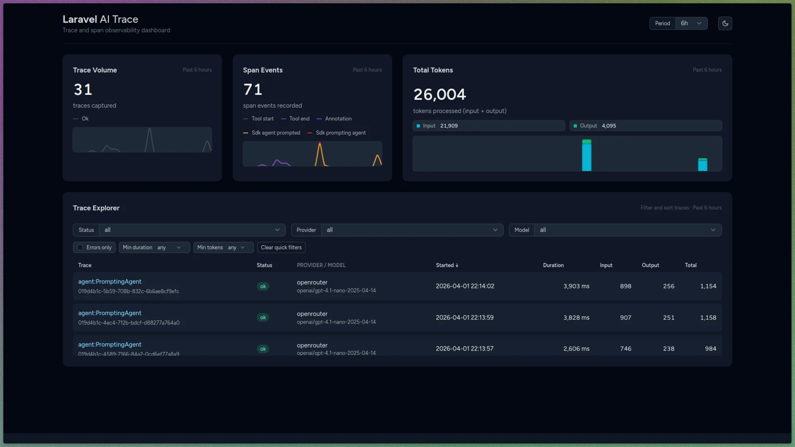

# Laravel AI Trace

Laravel AI Trace is a Laravel package for LangSmith-style tracing of AI workflows built with `laravel/ai`.

## Version

`v1.0.0` is the first package release.

## Dashboard UI

The dashboard UI is inspired by Laravel Pulse to keep things clean and simple while still giving developers real-time visibility into AI traces, spans, and events.

- Live period switching with auto-refresh cards
- Trace explorer with filters and sorting
- Trace detail inspector with waterfall context and span/event payload views
- Token usage visibility with input/output splits

## What It Does

- Captures end-to-end traces as `trace -> spans -> events`
- Records timing, ordering, retries, failures, and execution milestones
- Preserves parent-child span relationships for waterfall visualization
- Supports privacy controls for stored content (including redaction modes)
- Provides dashboard and observability views designed for fast debugging

## What It Does Not Do

- It does not implement generic HTTP-level AI instrumentation
- It does not target non-`laravel/ai` runtimes as a primary integration path
- It does not prioritize cost/budget analytics ahead of trace fidelity
