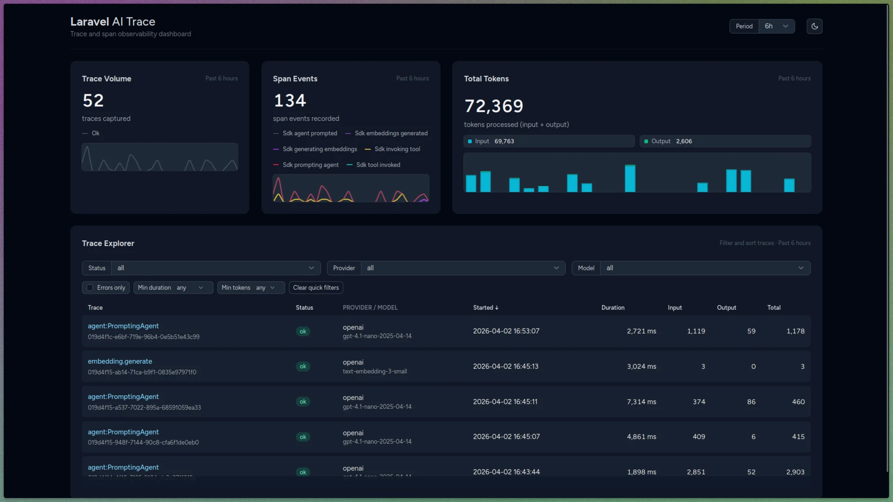
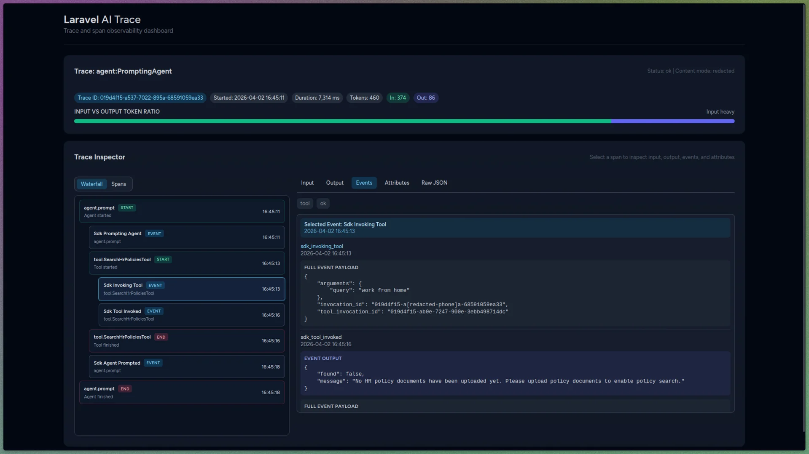

# Laravel AI Trace

Laravel AI Trace is a tracing and debugging package for AI workflows built with Laravel AI SDK (`laravel/ai`).

It captures full `trace -> span -> event` lifecycle data with SDK-native hooks so you can inspect execution order, retries, tool calls, streaming milestones, failures, and timing with waterfall-style visibility.



The dashboard provides period-based trend cards, a filterable trace explorer, and quick drill-in links for incident investigation and performance triage.



## Compatibility

- Laravel: `12+` (currently tested on `12.x` and `13.x`)
- PHP: `8.3+`
- Livewire: `3.6+` (including `4.x`)
- Laravel AI SDK (`laravel/ai`): currently validated against `v0.3.2`

## How It Works

Laravel AI Trace subscribes to Laravel AI SDK lifecycle events (for example agent start/end, tool start/end, stream completion, and failover events), then:

1. Correlates each callback to a trace and active span context.
2. Persists traces, spans, and events in relational tables.
3. Deduplicates repeated callbacks inside a configurable TTL window.
4. Applies privacy mode/redaction before storing sensitive content.
5. Serves dashboard/query data through package services.

This package is SDK-native by design. It does not use HTTP fallback instrumentation.

## Dashboard Stack

The dashboard is package-owned UI and uses:

- Livewire components for card rendering, polling, filters, and URL-backed state
- Blade components for layout, cards, tables, and inspector primitives
- Alpine.js + Chart.js for chart interactions and dataset updates
- Tailwind CSS for styling (with compiled package assets)

The design is inspired by Laravel Pulse, but the dashboard does not require a runtime dependency on `laravel/pulse`.

## Installation

1. Install Laravel AI SDK (if not already installed):

```bash
composer require laravel/ai
```

2. Install Laravel AI Trace:

```bash
composer require ryderasking/laravel-ai-trace
```

3. Publish package configuration and migrations:

```bash
php artisan vendor:publish --tag=ai-trace-config
php artisan vendor:publish --tag=ai-trace-migrations
```

4. Run migrations:

```bash
php artisan migrate
```

5. Optional smoke test:

```bash
php artisan ai-trace:smoke
```

## Dashboard Authorization Setup

Dashboard authorization is controlled by the host application via gate.

By default, Laravel AI Trace checks gate `viewAiTrace` (`ai-trace.dashboard.authorization_gate`). Define it in your `AppServiceProvider`:

```php
<?php

namespace App\Providers;

use App\Models\User;
use Illuminate\Support\Facades\Gate;
use Illuminate\Support\ServiceProvider;

class AppServiceProvider extends ServiceProvider
{
    public function boot(): void
    {
        Gate::define('viewAiTrace', function (User $user): bool {
            return $user->is_admin;
        });
    }
}
```

Behavior details:

- If the configured gate exists, access is decided by that gate.
- If no gate is defined, dashboard access falls back to `local` environment only.
- If `ai-trace.dashboard.enabled` is `false`, the dashboard routes return `404`.

## Configuration

Published config file: `config/ai-trace.php`

Important keys:

- `ai-trace.enabled`: master package toggle
- `ai-trace.track_ai_sdk`: subscribe/unsubscribe SDK event tracing
- `ai-trace.record_content_mode`: `none`, `hash`, `redacted`, `full`
- `ai-trace.sample_rate`: trace sampling (0..1)
- `ai-trace.dedup_ttl_seconds`: event deduplication window
- `ai-trace.stream.max_events_per_invocation`: cap stored stream timeline events
- `ai-trace.retention_days`: retention horizon for stored traces
- `ai-trace.dashboard.*`: domain/path/middleware/gate settings

## Routes

Dashboard routes are registered by the package service provider:

- `ai-trace.dashboard`: `/{dashboard-path}` (default path: `/ai-trace`)
- `ai-trace.dashboard.trace`: `/{dashboard-path}/traces/{traceId}`

## Data Model

Core persistence tables:

- `ai_traces`: one row per end-to-end workflow
- `ai_spans`: one row per operation (agent/tool/operation step)
- `ai_span_events`: timeline markers for span-level events

This structure enables parent-child waterfall reconstruction and detailed drilldown inspection.

## Production Notes

- Keep `record_content_mode=redacted` (or stricter) for sensitive environments.
- Use gate-based authorization for all non-local dashboard access.
- Tune `sample_rate` and stream event caps based on traffic profile.
- Plan retention cleanup strategy based on `retention_days` and compliance needs.
